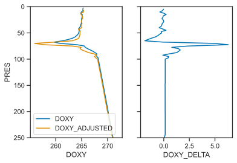

In this post we will work through performing the response time correction on oxygen observations following [Bittig et al. (2014)](https://doi.org/10.4319/lom.2014.12.617) on Argo data. The focus is more on accessing the proper variables within Argo than describing the actual correction. We will use [argopandas](https://github.com/ArgoCanada/argopandas) package to manage our data fetching from Argo, and use a function from [bgcArgoDMQC]((https://github.com/ArgoCanada/bgcArgoDMQC)) to do the response time correction. Other basic data manipulation and visualization will use the [pandas](https://pandas.pydata.org/), [numpy](https://numpy.org/), and [scipy](https://scipy.org/) packages, and [matplotlib](https://matplotlib.org/) and [seaborn](https://seaborn.pydata.org/) for plotting.


```python
# conda install -c conda-forge argopandas bgcArgoDMQC
import numpy as np
import pandas as pd
from scipy.interpolate import interp1d

import matplotlib.pyplot as plt
import seaborn as sns
sns.set(style='ticks', palette='colorblind')

import argopandas as argo
from bgcArgoDMQC import correct_response_time
```

We will use float [7900589](https://fleetmonitoring.euro-argo.eu/float/7900589), an APEX float in the North Atlantic which has the intermediate parameter `MTIME`, defined as the relative time in fractional days since the date of the profile `JULD`.


```python
flt = argo.float(7900589)
# grab core and bgc files for just the most recent cycle
core = flt.prof
bgc  = flt.bio_prof
core = core[core.file == core.file.iloc[-1]]
bgc  = bgc[bgc.file == bgc.file.iloc[-1]]
```

    Downloading 'https://data-argo.ifremer.fr/ar_index_global_prof.txt.gz'
    Downloading 'https://data-argo.ifremer.fr/argo_bio-profile_index.txt.gz'
    


```python
core
```


<div>
<style scoped>
    .dataframe tbody tr th:only-of-type {
        vertical-align: middle;
    }

    .dataframe tbody tr th {
        vertical-align: top;
    }

    .dataframe thead th {
        text-align: right;
    }
</style>
<table border="1" class="dataframe">
  <thead>
    <tr style="text-align: right;">
      <th></th>
      <th>file</th>
      <th>date</th>
      <th>latitude</th>
      <th>longitude</th>
      <th>ocean</th>
      <th>profiler_type</th>
      <th>institution</th>
      <th>date_update</th>
    </tr>
  </thead>
  <tbody>
    <tr>
      <th>1853971</th>
      <td>coriolis/7900589/profiles/R7900589_043.nc</td>
      <td>2021-11-08 12:13:44+00:00</td>
      <td>55.682</td>
      <td>-46.691</td>
      <td>A</td>
      <td>846</td>
      <td>IF</td>
      <td>2021-11-08 15:34:25+00:00</td>
    </tr>
  </tbody>
</table>
</div>


```python
bgc
```


<div>
<style scoped>
    .dataframe tbody tr th:only-of-type {
        vertical-align: middle;
    }

    .dataframe tbody tr th {
        vertical-align: top;
    }

    .dataframe thead th {
        text-align: right;
    }
</style>
<table border="1" class="dataframe">
  <thead>
    <tr style="text-align: right;">
      <th></th>
      <th>file</th>
      <th>date</th>
      <th>latitude</th>
      <th>longitude</th>
      <th>ocean</th>
      <th>profiler_type</th>
      <th>institution</th>
      <th>parameters</th>
      <th>parameter_data_mode</th>
      <th>date_update</th>
    </tr>
  </thead>
  <tbody>
    <tr>
      <th>179672</th>
      <td>coriolis/7900589/profiles/BR7900589_043.nc</td>
      <td>2021-11-08 12:13:44+00:00</td>
      <td>55.682</td>
      <td>-46.691</td>
      <td>A</td>
      <td>846</td>
      <td>IF</td>
      <td>MTIME PRES TEMP_DOXY C1PHASE_DOXY C2PHASE_DOXY...</td>
      <td>RRRRRARRRARR</td>
      <td>2021-11-08 16:02:45+00:00</td>
    </tr>
  </tbody>
</table>
</div>


```python
core_df = core.levels[['PRES', 'TEMP', 'PSAL']]
bgc_df  = bgc.levels[['PRES', 'MTIME', 'DOXY']]
```

    Downloading 'https://data-argo.ifremer.fr/dac/coriolis/7900589/profiles/R7900589_043.nc'
    Reading 1 file
    Downloading 'https://data-argo.ifremer.fr/dac/coriolis/7900589/profiles/BR7900589_043.nc'
    Reading 1 file
    


```python
core_df
```


<div>
<style scoped>
    .dataframe tbody tr th:only-of-type {
        vertical-align: middle;
    }

    .dataframe tbody tr th {
        vertical-align: top;
    }

    .dataframe thead th {
        text-align: right;
    }
</style>
<table border="1" class="dataframe">
  <thead>
    <tr style="text-align: right;">
      <th></th>
      <th></th>
      <th></th>
      <th>PRES</th>
      <th>TEMP</th>
      <th>PSAL</th>
    </tr>
    <tr>
      <th>file</th>
      <th>N_PROF</th>
      <th>N_LEVELS</th>
      <th></th>
      <th></th>
      <th></th>
    </tr>
  </thead>
  <tbody>
    <tr>
      <th rowspan="11" valign="top">coriolis/7900589/profiles/R7900589_043.nc</th>
      <th rowspan="5" valign="top">0</th>
      <th>0</th>
      <td>0.43</td>
      <td>6.7983</td>
      <td>34.502201</td>
    </tr>
    <tr>
      <th>1</th>
      <td>2.30</td>
      <td>6.7997</td>
      <td>34.501499</td>
    </tr>
    <tr>
      <th>2</th>
      <td>4.42</td>
      <td>6.8032</td>
      <td>34.501801</td>
    </tr>
    <tr>
      <th>3</th>
      <td>6.01</td>
      <td>6.8057</td>
      <td>34.501900</td>
    </tr>
    <tr>
      <th>4</th>
      <td>8.07</td>
      <td>6.8026</td>
      <td>34.502102</td>
    </tr>
    <tr>
      <th>...</th>
      <th>...</th>
      <td>...</td>
      <td>...</td>
      <td>...</td>
    </tr>
    <tr>
      <th rowspan="5" valign="top">3</th>
      <th>470</th>
      <td>NaN</td>
      <td>NaN</td>
      <td>NaN</td>
    </tr>
    <tr>
      <th>471</th>
      <td>NaN</td>
      <td>NaN</td>
      <td>NaN</td>
    </tr>
    <tr>
      <th>472</th>
      <td>NaN</td>
      <td>NaN</td>
      <td>NaN</td>
    </tr>
    <tr>
      <th>473</th>
      <td>NaN</td>
      <td>NaN</td>
      <td>NaN</td>
    </tr>
    <tr>
      <th>474</th>
      <td>NaN</td>
      <td>NaN</td>
      <td>NaN</td>
    </tr>
  </tbody>
</table>
<p>1900 rows × 3 columns</p>
</div>


```python
bgc_df
```


<div>
<style scoped>
    .dataframe tbody tr th:only-of-type {
        vertical-align: middle;
    }

    .dataframe tbody tr th {
        vertical-align: top;
    }

    .dataframe thead th {
        text-align: right;
    }
</style>
<table border="1" class="dataframe">
  <thead>
    <tr style="text-align: right;">
      <th></th>
      <th></th>
      <th></th>
      <th>PRES</th>
      <th>MTIME</th>
      <th>DOXY</th>
    </tr>
    <tr>
      <th>file</th>
      <th>N_PROF</th>
      <th>N_LEVELS</th>
      <th></th>
      <th></th>
      <th></th>
    </tr>
  </thead>
  <tbody>
    <tr>
      <th rowspan="11" valign="top">coriolis/7900589/profiles/BR7900589_043.nc</th>
      <th rowspan="5" valign="top">0</th>
      <th>0</th>
      <td>0.43</td>
      <td>-0.000613</td>
      <td>NaN</td>
    </tr>
    <tr>
      <th>1</th>
      <td>2.30</td>
      <td>-0.001296</td>
      <td>NaN</td>
    </tr>
    <tr>
      <th>2</th>
      <td>4.42</td>
      <td>NaN</td>
      <td>NaN</td>
    </tr>
    <tr>
      <th>3</th>
      <td>6.01</td>
      <td>NaN</td>
      <td>NaN</td>
    </tr>
    <tr>
      <th>4</th>
      <td>8.07</td>
      <td>NaN</td>
      <td>NaN</td>
    </tr>
    <tr>
      <th>...</th>
      <th>...</th>
      <td>...</td>
      <td>...</td>
      <td>...</td>
    </tr>
    <tr>
      <th rowspan="5" valign="top">3</th>
      <th>470</th>
      <td>NaN</td>
      <td>NaN</td>
      <td>NaN</td>
    </tr>
    <tr>
      <th>471</th>
      <td>NaN</td>
      <td>NaN</td>
      <td>NaN</td>
    </tr>
    <tr>
      <th>472</th>
      <td>NaN</td>
      <td>NaN</td>
      <td>NaN</td>
    </tr>
    <tr>
      <th>473</th>
      <td>NaN</td>
      <td>NaN</td>
      <td>NaN</td>
    </tr>
    <tr>
      <th>474</th>
      <td>NaN</td>
      <td>NaN</td>
      <td>NaN</td>
    </tr>
  </tbody>
</table>
<p>1900 rows × 3 columns</p>
</div>


You will notice looking at the printout of `bgc_df` that there are a lot of NaN values. The valid `MTIME` and `DOXY` values are in the `N_PROF` dimension 2. There are a variety of reasons why there might be `N_PROF` > 1 dimensions in an Argo profile. Where that is not the subject I won't go into why, and frankly I only know the valid data is in `N_PROF` = 2 by inspecting the dataframe. The valid core data is in `N_PROF` = 0. If we simply tried to line these separate dataframes up into one, we would fail miserably since our time and oxygen data would not be aligned with our physical data. So instead, we will use the common pressure axis to interpolate onto a common axis.


```python
# create a dataframe to store interpolated data in
df = pd.DataFrame()
# define a pressure axis to interpolate and a depth resolution
dP = 2.5
interp_pressure = np.arange(0, core_df['PRES'].max(), dP)
df['PRES'] = interp_pressure
# interpolate
for key, source in zip(['MTIME', 'TEMP', 'DOXY'], [bgc_df, core_df, bgc_df]):
    ix = source[key].notna() # remove nan values that will mess with interp
    f = interp1d(source['PRES'][ix], source[key][ix], bounds_error=False)
    df[key] = f(interp_pressure)
```


```python
df
```


<div>
<style scoped>
    .dataframe tbody tr th:only-of-type {
        vertical-align: middle;
    }

    .dataframe tbody tr th {
        vertical-align: top;
    }

    .dataframe thead th {
        text-align: right;
    }
</style>
<table border="1" class="dataframe">
  <thead>
    <tr style="text-align: right;">
      <th></th>
      <th>PRES</th>
      <th>MTIME</th>
      <th>TEMP</th>
      <th>DOXY</th>
    </tr>
  </thead>
  <tbody>
    <tr>
      <th>0</th>
      <td>0.0</td>
      <td>NaN</td>
      <td>NaN</td>
      <td>NaN</td>
    </tr>
    <tr>
      <th>1</th>
      <td>2.5</td>
      <td>-0.001345</td>
      <td>6.800030</td>
      <td>265.266078</td>
    </tr>
    <tr>
      <th>2</th>
      <td>5.0</td>
      <td>-0.001957</td>
      <td>6.804258</td>
      <td>265.227454</td>
    </tr>
    <tr>
      <th>3</th>
      <td>7.5</td>
      <td>-0.002542</td>
      <td>6.802751</td>
      <td>265.246096</td>
    </tr>
    <tr>
      <th>4</th>
      <td>10.0</td>
      <td>-0.003235</td>
      <td>6.804123</td>
      <td>264.956293</td>
    </tr>
    <tr>
      <th>...</th>
      <td>...</td>
      <td>...</td>
      <td>...</td>
      <td>...</td>
    </tr>
    <tr>
      <th>374</th>
      <td>935.0</td>
      <td>-0.139717</td>
      <td>3.358495</td>
      <td>263.701094</td>
    </tr>
    <tr>
      <th>375</th>
      <td>937.5</td>
      <td>-0.140046</td>
      <td>3.354090</td>
      <td>263.718486</td>
    </tr>
    <tr>
      <th>376</th>
      <td>940.0</td>
      <td>-0.140375</td>
      <td>3.351910</td>
      <td>263.735879</td>
    </tr>
    <tr>
      <th>377</th>
      <td>942.5</td>
      <td>-0.140704</td>
      <td>3.351850</td>
      <td>263.753272</td>
    </tr>
    <tr>
      <th>378</th>
      <td>945.0</td>
      <td>-0.141049</td>
      <td>3.351151</td>
      <td>NaN</td>
    </tr>
  </tbody>
</table>
<p>379 rows × 4 columns</p>
</div>


Now we are almost ready to perform the time response correction, except that *we don't know what the time response of this optode is*. Without a reference data set like in [Bittig et al. (2014)](https://doi.org/10.4319/lom.2014.12.617) or consecutive up- and down-casts as in [Gordon et al. (2020)](https://doi.org/10.5194/bg-17-4119-2020), knowing the response time is not possible. For the purposes of demonstration we will choose a boundary layer thickness (an equivalent parameter, but independent of temperature unlike response time) of 120 micrometers (equivalent to a response time of 67.2 seconds at 20 degrees C).


```python
Il = 120
df['DOXY_ADJUSTED'] = correct_response_time(df['MTIME'], df['DOXY'], df['TEMP'], Il)
df['DOXY_DELTA'] = df.DOXY - df.DOXY_ADJUSTED # change in oxygen
```

Finally, we'll plot the profiles to see the end result of the correction.


```python
# melt the dataframe so that we can use hue keyword when plotting
df_melt = df.melt(id_vars=['PRES', 'MTIME', 'TEMP', 'DOXY_DELTA'], var_name='DOXY_STATUS', value_name='DOXY')

fig, axes = plt.subplots(1, 2, sharey=True)
sns.lineplot(x='DOXY', y='PRES', hue='DOXY_STATUS', data=df_melt, sort=False, ax=axes[0])
sns.lineplot(x='DOXY_DELTA', y='PRES', data=df, sort=False, ax=axes[1])
axes[0].legend(loc=3)
axes[0].set_ylim((250, 0))

```

    C:\Users\GordonC\AppData\Local\Temp\1/ipykernel_25976/3416147837.py:2: FutureWarning: This dataframe has a column name that matches the 'value_name' column name of the resulting Dataframe. In the future this will raise an error, please set the 'value_name' parameter of DataFrame.melt to a unique name.
      df_melt = df.melt(id_vars=['PRES', 'MTIME', 'TEMP', 'DOXY_DELTA'], var_name='DOXY_STATUS', value_name='DOXY')
    


    (250.0, 0.0)


    

    


Some observations based on the above:

- It is important to recall that this is an *ascending* profile.
- The first thing your eye was likely drawn to is the large change 70m depth. I would wager that this single point is probably too dramatic, but also could be real as the gradient is strong there and oxygen would be favouring the higher side. This point makes me uncomfortable without reference data, but I can't say for sure that it is wrong. 
- From 250-100m, oxygen is relatively linear. In this section of the profile, we see a slighly lower `DOXY_ADJUSTED` than the original `DOXY`. Since oxygen is *decreasing* as the float *ascends*, the float remembers the higher concentration from the deeper depth, and therefore slightly overestimates the true oxygen concentration. 
- At points where there are "notches" in the original profile, those "notches" are amplified in the corrected on.

Thinking more generally about the wider Argo program, there are a few key questions: 

- How would you include this adjusted data in the B-file? Would it go in the `DOXY_ADJUSTED` field, which currently is used for gain adjustment ([Johnson et al. (2015)](https://doi.org/10.1175/JTECH-D-15-0101.1)), or would it merit a different field?
- Assuming there is no reliable way to determine boundary layer thickness (time constant), should Argo correct using a generic one since the adjusted data will be "more correct" than the original, even if it is not perfect?
- Given a lack of reference data, how would you flag the above adjusted profile? Are there any points you don't believe that should be flagged as bad?
